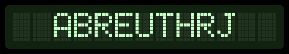

  
 

 
<h4 align="center">
  <b>Thiago Abreu</b>
</h4>

<h6 align="center">Software Developer | React-Native • React • PHP</h6>

  

&nbsp;

<h5>Interests</h5>

  Hi, my name is Thiago and I'm a full-stack developer! 

<h5>Experiences</h5>
<ul>
  <li>Software Engineer in Smartfood Itaperuna (6 years)</li>
  <li>Web development freelancer (6 months)</li>
  <li>Full-Stack developer in Nextale (1 year and 6 months)</li>
  <li>Full-Stack developer in coClub</li>
</ul>

<h5>Formation</h5>
<ul>
  <li>High School ✔️</li>
  <li>Degree in Computer Science 🔄</li>
  <li>UI + UX Designer Course ✔️</li>
  <li>NodeJS Mastering Course ✔️</li>
</ul>

&nbsp;

